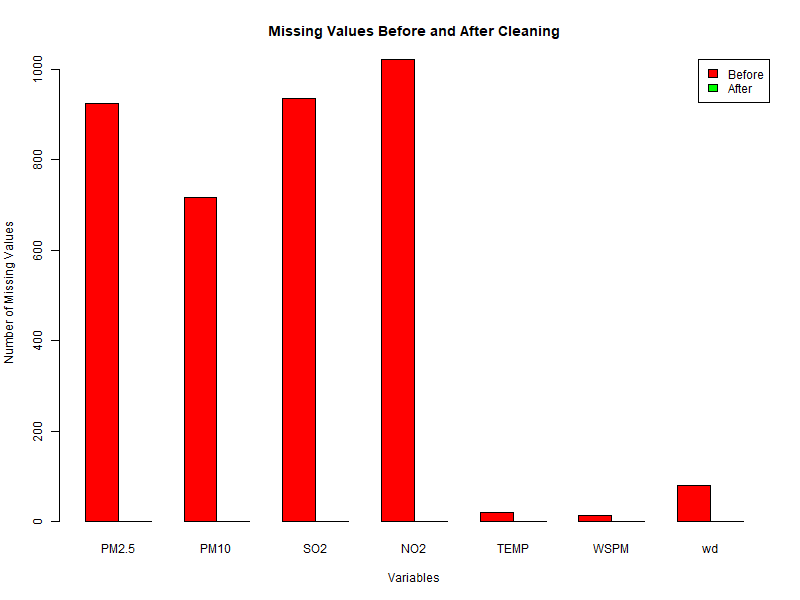

# R Programming Practical Assignment 1: Air Quality Data Cleaning

This repository contains the complete implementation, data analysis tables, visualization, and cleaned dataset for **Practical Assignment 1: Beijing Air Quality Data Cleaning**.

---

## 📁 Repository Structure

- [`air_quality_cleaning.R`](air_quality_cleaning.R) — Main R script containing all 10 tasks (Data import, NA/NULL/NaN demonstration, custom `missing_summary()` function, median & mode imputation loops, custom `clean_variable()` function, comparison table, visualization export, and cleaned dataset export).
- [`cleaned_air_quality_data.csv`](cleaned_air_quality_data.csv) — Exported dataset after median and mode imputation (35,064 records, 0 missing values).
- [`missing_values_chart.png`](missing_values_chart.png) — Bar chart graphic comparing missing value counts per variable before and after cleaning.
- [`ASSIGNMENT_SUBMISSION.md`](ASSIGNMENT_SUBMISSION.md) — Comprehensive submission report containing summary tables, comparison tables, visualization link, brief interpretation (135 words), and Git instructions.
- [`PRSA_Data_Aotizhongxin_20130301-20170228.csv`](PRSA_Data_Aotizhongxin_20130301-20170228.csv) — Raw input dataset.

---

## 📊 Summary Tables

### Missing Values Before Cleaning
| Variable | Total Records | Missing Values | Missing Percentage (%) |
| :--- | :---: | :---: | :---: |
| **PM2.5** | 35,064 | 925 | 2.64% |
| **PM10** | 35,064 | 718 | 2.05% |
| **SO2** | 35,064 | 935 | 2.67% |
| **NO2** | 35,064 | 1,023 | 2.92% |
| **TEMP** | 35,064 | 20 | 0.06% |
| **WSPM** | 35,064 | 14 | 0.04% |
| **wd** | 35,064 | 81 | 0.23% |

### Comparison Table (Before vs. After)
| Variable | Missing Before | Missing After | Values Replaced | Strategy | Imputed Value |
| :--- | :---: | :---: | :---: | :--- | :---: |
| **PM2.5** | 925 | 0 | 925 | Median | `58.0` |
| **PM10** | 718 | 0 | 718 | Median | `87.0` |
| **SO2** | 935 | 0 | 935 | Median | `9.0` |
| **NO2** | 1,023 | 0 | 1,023 | Median | `53.0` |
| **TEMP** | 20 | 0 | 20 | Median | `14.5` |
| **WSPM** | 14 | 0 | 14 | Median | `1.4` |
| **wd** | 81 | 0 | 81 | Mode | `"NE"` |

---

## 📈 Missing Value Visualization



---

## 📝 Brief Interpretation (135 Words)

> The Beijing Air Quality dataset initially contained 7,271 missing observations spread across key environmental indicators, with individual column missingness ranging from 0.04% in wind speed (`WSPM`) to 2.92% in nitrogen dioxide (`NO2`). To address missing records without deleting rows or distorting time-series integrity, context-appropriate statistical imputation techniques were applied based on data type and distribution.
> 
> For continuous numerical variables (`PM2.5`, `PM10`, `SO2`, `NO2`, `TEMP`, `WSPM`), median replacement was utilized to maintain robust central tendencies while minimizing the distortive impact of atmospheric outliers. For the categorical variable wind direction (`wd`), statistical mode imputation filled missing entries with the most frequent direction (`NE`). Post-cleaning validation confirmed 100% complete records across all 35,064 rows, resulting in a fully restored dataset ready for downstream statistical modeling and environmental analysis.

---

## 🚀 How to Run locally

Make sure R is installed, then run:

```bash
Rscript air_quality_cleaning.R
```
